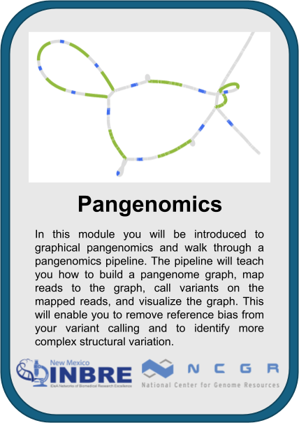
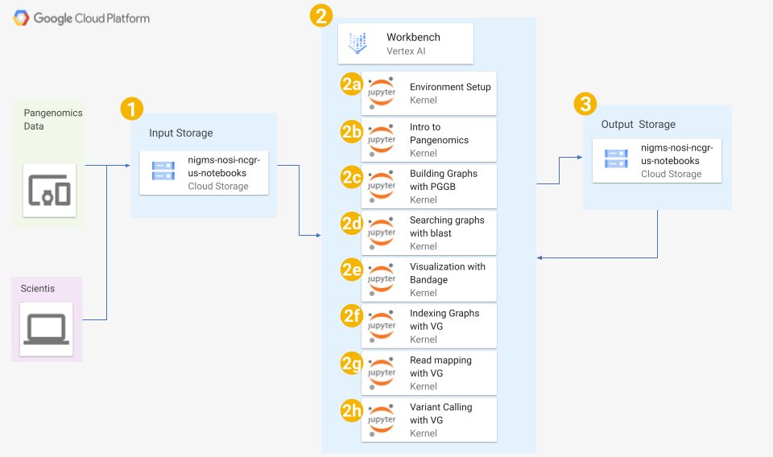

# NIGMS Sandbox: Pangenomics Module
---------------------------------

## **Contents**

+ [Overview](#overview)
+ [Background](#background)
+ [Before Starting](#before-starting)
+ [Getting Started](#getting-started)
+ [Software Requirements](#software-requirements)
+ [Architecture Design](#architecture-design)
+ [Data](#data)
+ [Funding](#funding)
+ [License for Data](#license-for-data)
+ [Wrapping Up](#wrapping-up)
+ [Additional Resources](#additional-resources)
+ [Troubleshooting](#troubleshooting)

## **Overview**

This module will introduce you to (graphical) pangenomics and walk you through a pangenomics pipeline.
Specifically, you will learn how to build a pangenome graph, index the graph for analysis, map reads to the graph, call variants on the mapped reads, and visualize the graph.
All analyses will be performed on the Google Cloud Platform (GCP).
The estimated cost to complete the whole module is about $2, assuming you tear down all resources upon completion.
See the [Wrapping Up](#wrapping-up) section for details on how to tear down resources.


## **Background**

A *pangenome* is a collection of genomes from the same species.
Compared to a reference genome, a pangenome is a less biased, more comprehensive representation of sequence preservation and variation within a population.
While the pangenome may provide greater insight into questions related to the genetic and genomic nature of a species, these data require the use of bioinformatics tools that are different than those typically used on reference genomes.
This module aims to introduce you to the idea of *pangenome graphs* and the bioinformatics tools used for their analysis.

This video XXX has a brief overview of pangenomics and this module.


## **Before Starting**

This module is designed to run on the Google Cloud Platform (GCP).
Follow the instructions below to prepare to run the module on GCP.

<details>

<summary>Setting up GCP</summary>

See the [Vertex AI Quickstart instructions](https://cloud.google.com/vertex-ai/docs/workbench/instances/create-console-quickstart) for details on steps 1-5.

1. Create a Google Cloud account
2. Create a Google Cloud project
3. Enable billing for your Google Cloud project
4. Go to Vertex AI Workbench and create a new VM instance using "CREATE NEW" -> "ADVANCED OPTIONS". The configurations for each page are described below. Click the "Continue" button at the bottom of each page to go to the next page. **Any configuration not explicitly mentioned below should use its default setting**.
   * Details:<br/>&emsp;Name: nigms-pangenomics-module (this is optional; you can use whatever name you want or the default)<br/>&emsp;Region: us-east4<br/>&emsp;Zone: us-east4-a<br/>&emsp;Workbench type:<br/>&emsp;&emsp;Type: Instance
   * Environment:<br/>&emsp;JupyterLab Version: JupyterLab 4.x
   * Machine type:<br/>&emsp;Series: N2<br/>&emsp;Machine type: n2-standard-4<br/>&emsp;Idle shutdown:<br/>&emsp;&emsp;Enable Idle Shutdown: Checked<br/>&emsp;&emsp;Time of inactivity before shutdown (Minutes): 60
   * Disks: Use default settings
   * Networking:<br/>&emsp;Assign external IP address: Checked<br/>&emsp;Allow proxy access: Checked
   * IAM and security<br/>&emsp;Security options:<br/>&emsp;&emsp;Root access to the instance: Checked<br/>&emsp;&emsp;File downloading: Checked<br/>&emsp;&emsp;Terminal access: Checked
   * System health: Use default settings
  
   The last configuration page - System health - will not have a "Continue" button. Instead, use the "Create" button below the page to create the Vertex AI Workbench VM instance you just configured.
6. Click "OPEN JUPYTERLAB" on your VM instance to open JupyterLab

</details>

<details>
 
<summary>Installing Software</summary>

To install the software for this module in JupyterLab, open a Terminal ("File" -> "New Launcher" -> "Terminal") and run the following commands:
```bash
cd ~
git clone https://github.com/ncgr/NIGMS-Sandbox-Pangenomics-Module.git NIGMS-Sandbox-Pangenomics-Module
bash -i ./NIGMS-Sandbox-Pangenomics-Module/scripts/0-setup.sh
```
After the last command completes, close the terminal and restart the VM instance in the Vertex AI Workbench.

There should now be a new kernal in the JupyterLab launcher called "nigms-pangenomics".
This is the kernel you should use with every notebook in the module.
The launcher should also contain two new sections: "Submodule Notebooks" and "Visualization Software".
Submodule notebooks contains an ordered list of the notebooks in this module, one for each submodule.
Clicking on a submodule will open the corresponding notebook.
Visualization Software contains a list of visualization software used in this module.
Clicking on a program in this list will open the program in a new window in your Web Browser.

</details>


## **Getting Started**

After following the [Before Starting](#before-starting) instructions, the JupyterLab launcher ("File" -> "New Launcher") will contain a "Submodule Notebooks" section.
This section contains an ordered list of the notebooks in this module, one for each submodule.
Clicking on a submodule in this section will open the corresponding notebook.
To begin, click on the "Environment Setup" notebook.

Alternatively, you can use the JupyterLab file browser.
Here is the location and file structure of the module notebooks:
```
NIGMIS-Sandbox-Pangenomics-Module/
└── module_notebooks/
    ├── 00-environment-setup.ipynb
    ├── 01-intro-to-pangenomics.ipynb
    ├── 02-building-graphs-with-pggb.ipynb
    ├── 03-searching-graphs-with-blast.ipynb
    ├── 04-visualization.ipynb
    ├── 05-indexing-graphs-with-vg.ipynb
    ├── 06-read-mapping-with-vg.ipynb
    └── 07-variant-calling-with-vg.ipynb
```
`module_notebooks/` contains Jupyter notebooks - one for each submodule.
To open a notebook, simply double-click on it it.
To begin this module, open the `00-environment-setup.ipynb` notebook.


## **Software Requirements**

The following software is required for this module:

* [PGGB](https://github.com/pangenome/pggb)
* [vg](https://github.com/vgteam/vg)
* [BLAST](https://www.ncbi.nlm.nih.gov/books/NBK569861/)
* [Bandage](https://rrwick.github.io/Bandage/)
* [Samtools](https://www.htslib.org/)

All of these programs can be installed in JupterLab running on the GCP Vertex AI Workbench following the Installing Software instructions in the [Before Starting](#before-starting) section.


## **Architecture Design**



The architecture of this workshop is composed of 3 major parts: 1) input data from storage, 2) an analysis pipeline run on the GCP Vertex AI Workbench, and 3) output data to storage, which itself is used as input in subsequent steps of the pipeline.
The analysis pipeline part (2) is composed of the following submodules:

<ol type="a">
  <li>Setting up the environment for the module</li>
  <li>An introduction to graphical pangenomics</li>
  <li>A tutorial on how to build a pangenome graph using PGGB</li>
  <li>A tutorial on how to search a pangenome graph using BLAST</li>
  <li>A tutorial on how to visualize a pangenome graph using Bandage</li>
  <li>A tutorial on indexing pangenome graphs with vg for downstream analysis</li>
  <li>A tutorial on mapping reads to an indexed pangenome graph</li>
  <li>A tutorial on calling variants on reads mapped to a pangenome graph</li>
</ol>

All submodules in the pipeline use a custom `nigms-pangenomics` Jupyter kernel, which can be installed following the instructions in the [Before Starting](#before-starting) section.

## **Data**

This module uses the following data:

* 3 genome assemblies acquired from the [Yeast Population Reference Panel (YPRP)](https://yjx1217.github.io/Yeast_PacBio_2016/welcome/)
  * S288C (reference)
  * SK1
  * Y12
* Illumina paired-end reads acquired from NCBI
  * SK1
* Gene sequences acquired from [Saccharomyces Genome Database (SGD)](https://www.yeastgenome.org/)
  * CUP1-1
  * YHR053C

## **Funding**

This module was developed by the National Center for Genome Resources (NCGR) as part of the Data Science Core for the New Mexico IDeA Network of Biomedical Research Excellence (NM-INBRE).
The work was supported by National Institutes of Health (NIH) grant number P20GM103451 and NIH supplement award number Q02588.


## **License for Data**

Text and materials are licensed under a Creative Commons CC-BY-NC-SA license.
The license allows you to copy, remix, and redistribute any of our publicly available materials, under the condition that you attribute the work (details in the license) and do not make profits from it.
More information is available [here](https://tilburgsciencehub.com/about).


This work is licensed under a [Creative Commons Attribution-NonCommercial-ShareAlike 4.0 International License](http://creativecommons.org/licenses/by-nc-sa/4.0/)


## **Wrapping Up**

Once you have completed the module, we recommend deleting the Vertex AI Workbench VM instance you created since it costs money even when it's not running.

You can download a copy of your work from this module before deleting the VM by creating a `.zip` file of your copy of this repository.
To do this, in JupyterLab open a Terminal ("File" -> "New Launcher" -> "Terminal") and run the following commands:
```bash
cd ~
zip -r NIGMS-Sandbox-Pangenomics-Module.zip NIGMS-Sandbox-Pangenomics-Module
```
You can then download this file from JupyterLab by opening the File Browser in the left menu, clicking the Home (`/`) button, right-clicking on the `NIGMS-Sandbox-Pangenomics-Module.zip` file and selecting "Download" in the menu that appears.

When you are ready to delete your Vertex AI Workbench VM instance, go into the Vertex AI Workbench, check the box next to the VM instance that you want to delete, and click the "Delete" button in the menu that appears at the top.

## **Additional Resources**

This module is based on a workshop offered by the National Center for Genome Resources (NCGR) as part of the Data Science Core for the New Mexico IDeA Network of Biomedical Research Excellence (NM-INBRE).
The workshop covers all of the material in this module and much more.
See the [NM-INBRE Data Science Core webpage](https://nminbre.org/data-science-core/) for details.

## Troubleshooting

<details>
  
<summary>Resetting Bandage</summary>

Sometimes the Bandage software can break, i.e. there will be a message that say "KasmVNC encountered an error."
When this occurs, you can reset the Bandage software by opening a Terminal in JupyterLab ("File" -> "New Launcher" -> "Terminal") and running the following commands:
```bash
cd ~
docker compose -f NIGMS-Sandbox-Pangenomics-Module/bandage/compose.yml up -d --build --force-recreate
```

</details>
